# FormlessAI

FormlessAI is a project powered by LangChain, GPT, and OpenAI, designed to streamline information extraction through conversational agents.

## Notes:I am getting an rate limit error when trying to use continuosly(free version) be careful when running. it will take time sometime

## Prerequisites

```
Python 3.10
open ai api_key
Conda env(Optional but recommended)
```

## Setup

Clone the repository:

   ```bash
   git clone https://github.com/asjad895/FormLessAI
   cd FormLessAI
   ```

install dependencies

```
pip install -r requirements.txt
```
updates api key in env.py file(create a env file)
load here

```
OPENAI_API_KEY = os.environ.get("OPENAI_API_KEY")
```

in ```chat.py``` file

## Run application

```
python fapp.py
```

## Run individual agents

uncomment corresponding usage and input to test

```
python chat.py
```

FormlessAI.

## Result

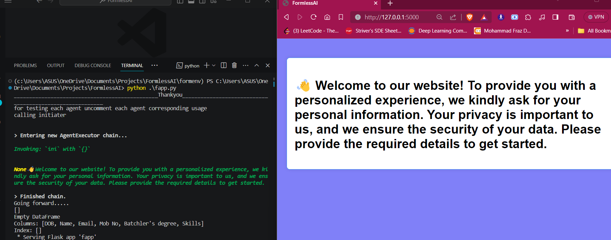

after 10 seconds the url of welcome page automatically redirected to /Form url where all conversation will be happen


this is the response by user and handling in backend.
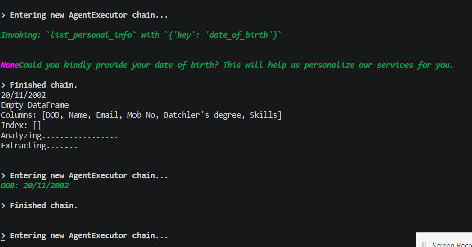

### handling logic

take user input and verify their correctness to asked question.
checking whether hesitating,if hesistating call a function to chat user else store user_input(response)
extracted information by Extracting agent help.
u can check full logic in function  .

```analze_user_input(user_input=user_input, key=key)```
in ```fapp.py``` file

once verified we will get second question asked by user in web page.
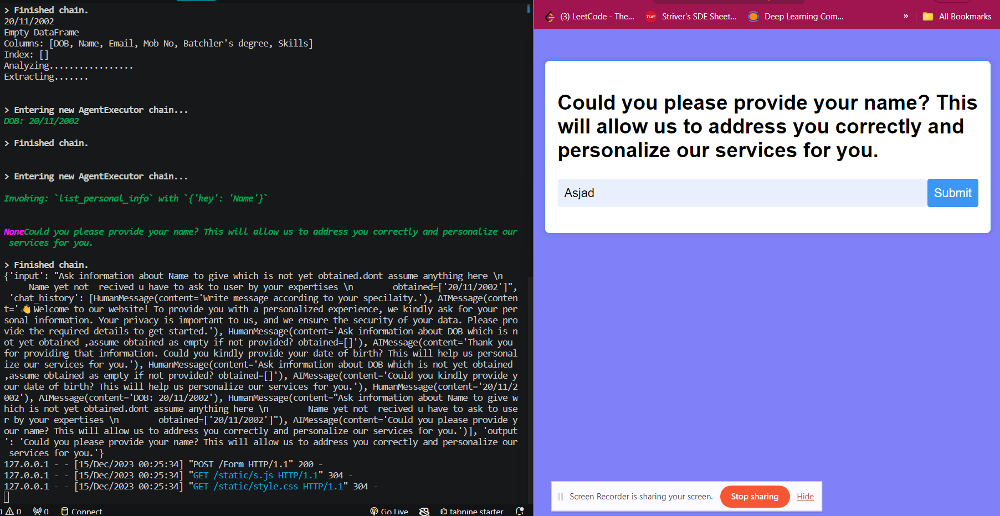

## Testing Out of context response,hesitation by user

when we are giving input as why(any sentence which have 'why' indicates hesitatng between conversation of taking information)
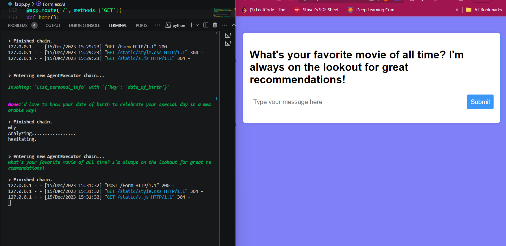

you can look into terminal for seeing flow in backend(left side).

you can see what convincing agent send as response when hesitating at 1st initiation of conversation to get user confidence  on web pages (right side)

### Out of context:

we can see when user giving out of context input like(abuse,adultry,anything simialr)


## Chat flow
Notes:in ```green``` color text is the output return by agents.that we are serving in page for user conversation.

when user gives response in web page i am printing it in terminal after that u can see.

here i did not added welcome message  but it always start from welocme message (```check on top of this page```)

the texts which are in list is the chat history common for all the agents(```langchain Memory```)

1st question-answer(client server):DOB
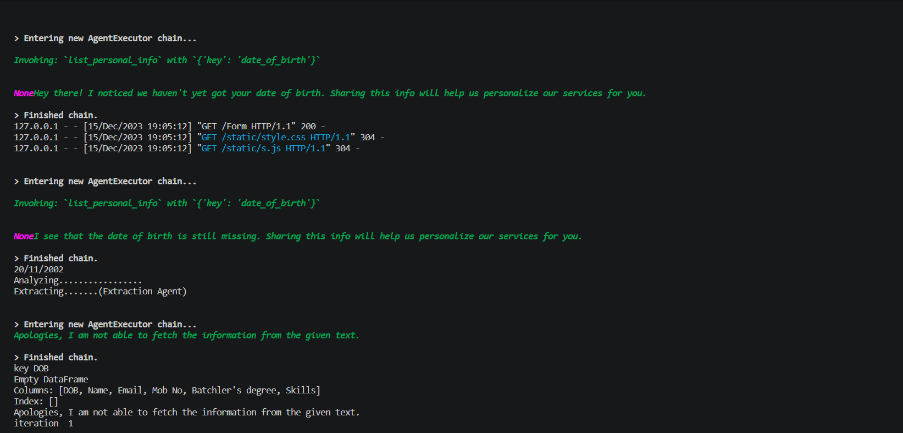
2nd question-answer(client server):name
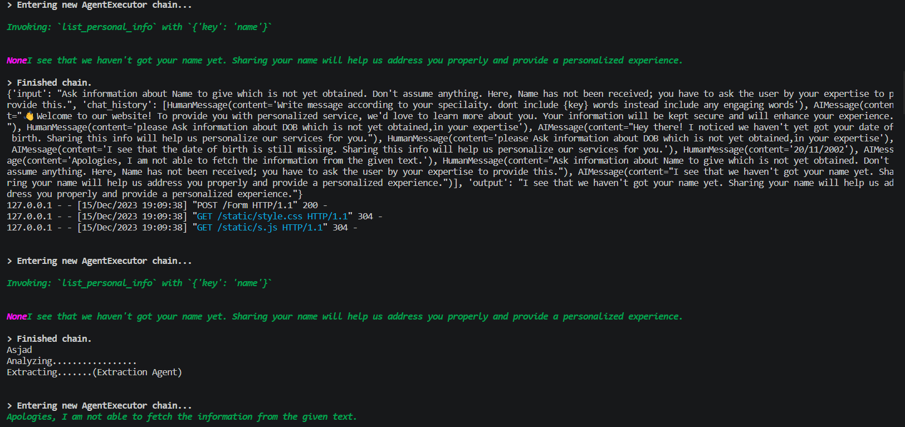
3rd question-answer(client server):Email
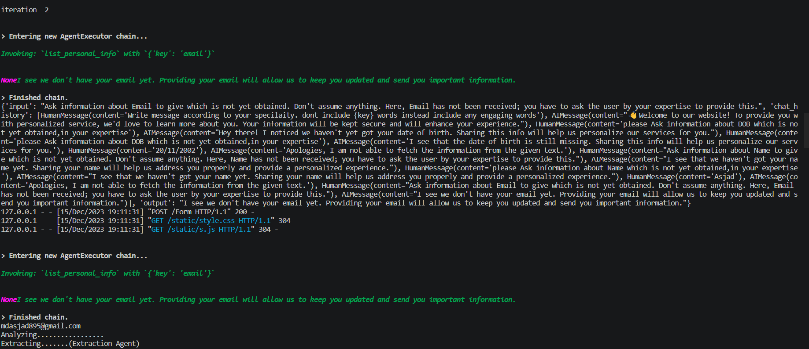
4th question-answer(client server) :Mob No
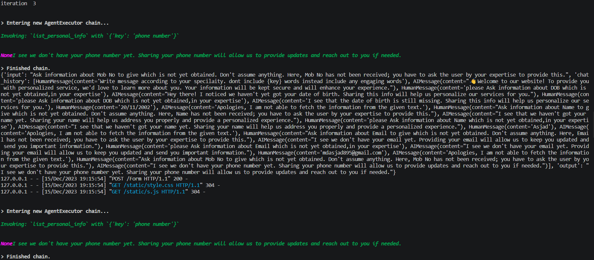
4th question-answer(client server)
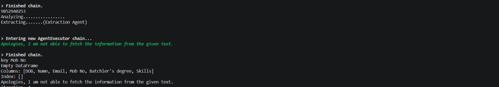
5th question-answer(client server) :batchlors degree
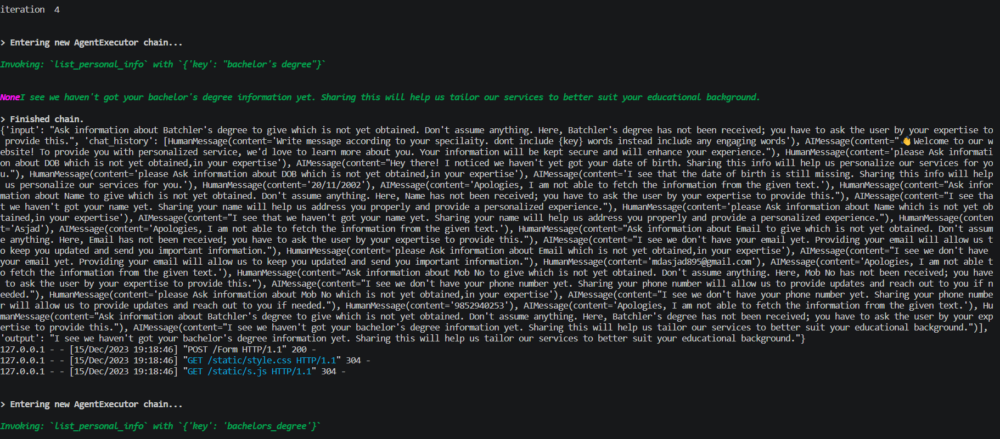
5th question-answer(client server)
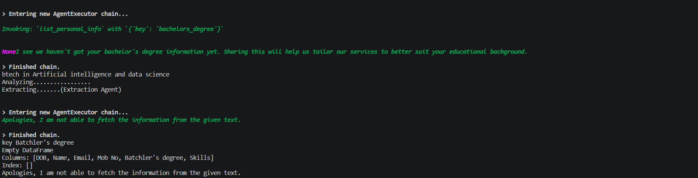
6th question-answer(client server) :skills
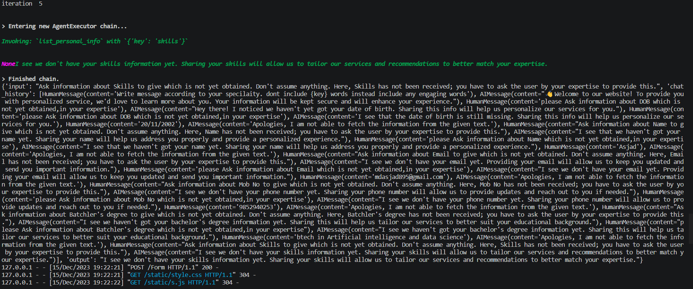
6th question-answer(client server)
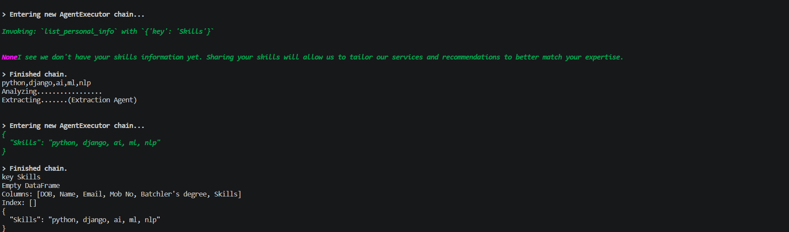
Thanks message from Taker Agent to the user.
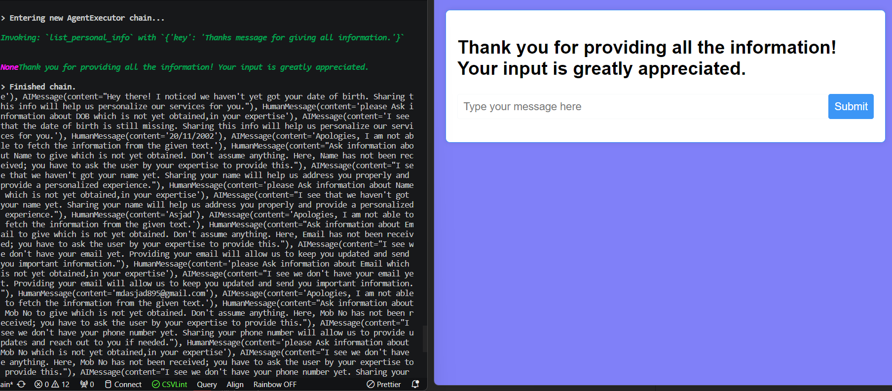

### Result Extracted Data

All the extracted data has been saved in ```user_data.csv``` file.