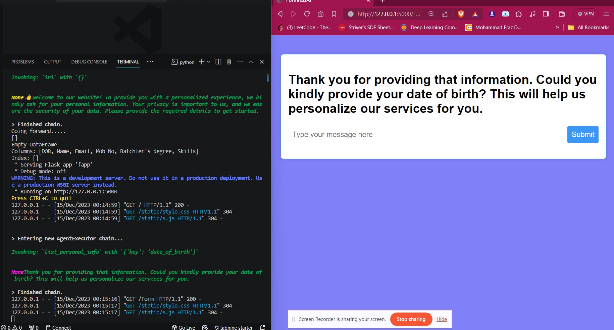

# FormlessAI

FormlessAI is a project powered by LangChain, GPT, and OpenAI, designed to streamline information extraction through conversational agents.

## Prerequisites

```
Python 3.10
Conda env(Optional but recommended)
```

## Setup

Clone the repository:

   ```bash
   git clone <Your_Repository_Link>
   cd FormLessAI
   ```

install dependencies

```
pip install -r requirements.txt
```

## Run application

```
python fapp.py
```

## Run individual agents
uncomment corresponding usage and input to test 
```
python chat.py
```

FormlessAI.

## Result


after 10 seconds the url of welcome page automatically redirected to /Form url where all conversation will be happen



this is the response by user and handling in backend.


### handling logic

take user input and verify their correctness to asked question.
checking whether hesitating,if hesistating call a function to chat user else store user_input(response)
extracted information by Extracting agent help.
u can check full logic in function  .

```analze_user_input(user_input=user_input, key=key)```
in ```fapp.py``` file

once verified we will get second question asked by user in web page.


## Testing Out of context response,hesitation by user
